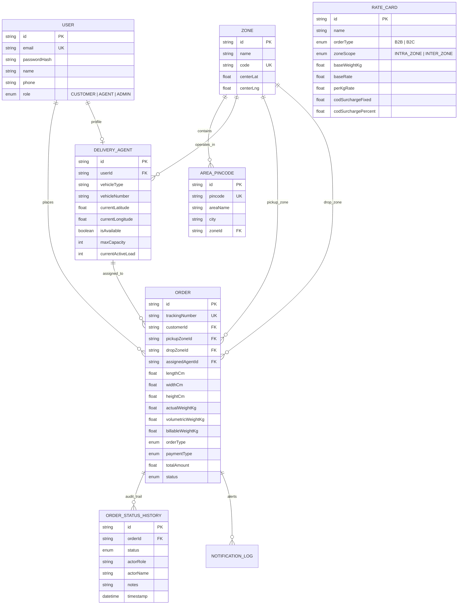

# Last-Mile Delivery Management & Dispatch Platform 🚚

A production-grade, full-stack last-mile logistics delivery management platform featuring automated geometric zone detection, dynamic volumetric rate calculations (zero hardcoding), intelligent nearest-agent auto-assignment, immutable event-sourced order tracking, customer-driven failure recovery, and cross-channel notifications.

---

## 🌟 Key System Capabilities

- 📐 **Dynamic Volumetric Rate Engine**: Automatically calculates cubic volume $(L \times B \times H) / 5000$, bills on higher of actual physical vs volumetric weight, queries active database rate cards (B2B vs B2C, Intra vs Inter-zone), and applies COD cash handling surcharges.
- 🗺️ **Automated Geometric Zone Resolution**: Resolves postal pincodes and GPS coordinates to operational delivery hubs using Haversine great-circle distance formulas and hierarchical area mappings.
- ⚡ **Intelligent Agent Auto-Assignment**: Multi-factor allocation heuristic matching nearest online drivers, prioritizing zone alignment, enforcing maximum load capacity thresholds, and balancing active delivery queues.
- 📜 **Immutable Order Lifecycle & Audit History**: Finite state machine transitions (`PLACED` $\to$ `ASSIGNED` $\to$ `PICKED_UP` $\to$ `IN_TRANSIT` $\to$ `OUT_FOR_DELIVERY` $\to$ `DELIVERED` / `FAILED`) logged with non-destructive actor details, timestamps, and geolocation coordinates.
- 🔄 **Failed Delivery Recovery & Rescheduling**: Mandatory reason code capturing on failed delivery attempts, automated customer alerts with secure rescheduling portal, and driver reassignment for the rescheduled slot.
- 📱 **Multi-Role Portals**: Dedicated workspaces for **Customers** (Order booking & Live tracking), **Delivery Agents** (Mobile task deck & GPS simulation), and **Admins** (Master dispatch deck, Rate Card builder, Zone manager, Fleet telemetry).

---

## 🛠️ Architecture & Tech Stack

- **Framework**: [Next.js 14](https://nextjs.org/) (App Router, TypeScript, React 18)
- **Styling**: [Tailwind CSS](https://tailwindcss.com/), Lucide Icons
- **Database & ORM**: [Prisma ORM](https://www.prisma.io/) with SQLite (zero-config local run) / PostgreSQL (production)
- **Authentication**: JWT session tokens with role-based access control (`CUSTOMER`, `AGENT`, `ADMIN`) and `bcryptjs` password hashing
- **Mapping**: OpenStreetMap & Leaflet telemetry integration
- **Notifications**: Multi-channel email & SMS dispatcher with in-app simulation logs
- **Testing**: [Vitest](https://vitest.dev/) automated test suite for billing math, zone proximity, and state transitions

---

## 🚀 Quick Setup & Installation Guide

### Prerequisites
- [Node.js](https://nodejs.org/) (v18+ or v20+)
- npm / yarn / pnpm

### 1. Clone the Repository
```bash
git clone https://github.com/<your-username>/last-mile-delivery-tracker.git
cd last-mile-delivery-tracker
```

### 2. Install Dependencies
```bash
npm install
```

### 3. Setup Environment Variables
Create a `.env` file in the root directory (or copy from `.env.example`):
```bash
cp .env.example .env
```

Default `.env` contents:
```env
DATABASE_URL="file:./dev.db"
JWT_SECRET="last_mile_delivery_tracker_super_secret_jwt_key_2026"
NEXT_PUBLIC_APP_URL="http://localhost:3000"
SMTP_HOST=""
SMTP_PORT="587"
SMTP_USER=""
SMTP_PASS=""
SMTP_FROM="notifications@deliverytracker.com"
ENABLE_SIMULATED_NOTIFICATIONS="true"
```

### 4. Initialize Database Schema & Seed Realistic Demo Data
```bash
# Push schema to SQLite database
npx prisma db push

# Populate zones, rate cards, demo customers, delivery agents with GPS coordinates, and orders
npm run db:seed
```

### 5. Start Development Server
```bash
npm run dev
```
Open [http://localhost:3000](http://localhost:3000) in your browser.

---

## 🔑 Pre-Configured Demo Credentials

For quick evaluation, click the **1-Click Demo Login** buttons in the navigation bar or use the following credentials:

| Role | Email | Password | Description |
| :--- | :--- | :--- | :--- |
| **Admin** | `admin@deliverytracker.com` | `admin123` | Master operations console, rate cards, zones, fleet monitor |
| **Customer (B2C)** | `customer@gmail.com` | `customer123` | Standard retail customer with active & delivered orders |
| **Customer (B2B)** | `b2b@acmecorp.com` | `customer123` | Enterprise logistics customer with heavy freight orders |
| **Delivery Agent 1** | `agent.rajesh@deliverytracker.com` | `agent123` | Motorcycle courier in North Zone |
| **Delivery Agent 2** | `agent.amit@deliverytracker.com` | `agent123` | Electric Van courier in South Zone |

---

## 🧮 Rate Calculation Logic & Formula Breakdown

### 1. Volumetric Weight Formula
Courier volume standardizes cargo density:
$$\text{Volumetric Weight (kg)} = \frac{\text{Length (cm)} \times \text{Width (cm)} \times \text{Height (cm)}}{5000}$$

### 2. Billable Weight
$$\text{Billable Weight} = \max(\text{Actual Physical Weight}, \text{Volumetric Weight})$$

### 3. Dynamic Zone Rate Calculation
The system looks up the active `RateCard` configured in the database matching `(OrderType: B2B/B2C, ZoneScope: INTRA_ZONE/INTER_ZONE)`:
$$\text{Base Freight} = \text{BaseRate}$$
$$\text{Extra Weight} = \max(0, \text{Billable Weight} - \text{BaseWeightKg})$$
$$\text{Weight Surcharge} = \text{Extra Weight} \times \text{PerKgRate}$$

### 4. Cash-on-Delivery (COD) Surcharge
If `paymentType === "COD"`:
$$\text{COD Surcharge} = \max\left(\text{FixedSurcharge}, \text{MinSurcharge}, \text{DeclaredValue} \times \frac{\text{CODPercent}}{100}\right)$$

### 5. Total Price
$$\text{Total Amount} = \text{Base Freight} + \text{Weight Surcharge} + \text{COD Surcharge} + \text{Tax}$$

---

## 🤖 Intelligent Auto-Assignment Logic

When an order is created or auto-assigned by Admin:
1. **Candidate Pool Selection**: Query all delivery agents where `isAvailable === true` and `currentActiveLoad < maxCapacity`.
2. **Proximity Calculation**: Calculates great-circle Haversine distance from agent's current coordinates $(\text{lat}, \text{lng})$ to order pickup coordinates.
3. **Scoring Function**:
   $$\text{Score} = \text{Distance (km)} + (\text{ActiveLoad} \times 0.5) - (\text{OperatingZoneMatch} ? 2.0 : 0.0)$$
   *(Lower score is ranked first).*
4. **Atomic Transaction**: The best candidate is assigned, order transitions to `ASSIGNED`, agent's active load increments, and immutable history log is written.

---

## 🔄 Failed Delivery & Rescheduling Workflow

1. When a delivery agent encounters an issue, they mark the order as `FAILED` with a mandatory reason code (e.g. *Customer Unavailable*, *Incorrect Address*).
2. The order transitions to `FAILED`, the agent's active load is released, and a notification is dispatched to the customer.
3. The customer accesses `/track/[trackingNumber]` or their dashboard, clicks **Reschedule**, and selects a new delivery date and time slot.
4. The system updates the order to `RESCHEDULED` and triggers automatic re-assignment for the rescheduled attempt.

---

## 📊 Database Schema (Prisma Data Model)



---

## 🌐 Complete REST API Documentation

### Authentication (`/api/auth`)
- `POST /api/auth/register`: Register user with role (`CUSTOMER`, `AGENT`, `ADMIN`).
- `POST /api/auth/login`: User login, returns JWT token & sets session cookie.
- `GET /api/auth/me`: Fetch authenticated user profile & agent details.

### Dynamic Pricing & Rate Engine (`/api/rates`)
- `POST /api/rates/calculate`: Computes volumetric weight, zone matrix, rate card lookup, and full financial breakdown.

### Rate Cards & Zones Configuration (`/api/rate-cards`, `/api/zones`)
- `GET /api/rate-cards`: List configured B2B and B2C rate cards.
- `POST /api/rate-cards`: Admin create rate card (Intra/Inter-zone, base/increment rates, COD fees).
- `PUT /api/rate-cards`: Admin update rate card parameters.
- `GET /api/zones`: List operational delivery zones with pincode counts and active agents.
- `POST /api/zones`: Admin create delivery zone with centroid coordinates.
- `POST /api/zones/pincodes`: Admin map postal pincodes to zones.

### Orders & Dispatch Management (`/api/orders`)
- `GET /api/orders`: Query orders with RBAC and multi-filters (status, zone, agent, orderType).
- `POST /api/orders`: Create new delivery order with auto-calculated charges and immutable logging.
- `GET /api/orders/[id]`: Fetch single order details with full immutable audit trail.
- `POST /api/orders/[id]/assign`: Auto-assign nearest available agent or manual agent assignment.
- `POST /api/orders/[id]/status`: Transition order status (`PICKED_UP`, `IN_TRANSIT`, `OUT_FOR_DELIVERY`, `DELIVERED`, `FAILED`) or Admin override.
- `POST /api/orders/[id]/reschedule`: Customer reschedule failed delivery for a new date/slot.
- `GET /api/orders/track/[trackingNumber]`: Public tracking endpoint with live map telemetry.

### Delivery Fleet Telemetry (`/api/agents`)
- `GET /api/agents`: List all agents with live availability, active capacity loads, and GPS coordinates.
- `PUT /api/agents`: Toggle online/offline status or update live GPS coordinates.

---

## 🧪 Automated Testing

Run the Vitest test suite to verify volumetric math, rate calculation edge cases, Haversine distance formulas, and finite state machine transitions:

```bash
npm test
```

Test coverage includes:
- Volumetric weight vs actual weight comparison
- Intra-zone vs Inter-zone rate card application
- COD fixed vs percentage fee evaluation
- Haversine proximity calculations
- Order state transition graph enforcement & admin overrides

---

## ☁️ Deployment Guide (Vercel / Render / Railway)

### Deploying on Vercel
1. Push repository to GitHub.
2. Import project into [Vercel](https://vercel.com).
3. Set environment variables (`DATABASE_URL`, `JWT_SECRET`, `NEXT_PUBLIC_APP_URL`).
4. Set Build Command: `prisma generate && next build`.

### Deploying with PostgreSQL (Production)
In `prisma/schema.prisma`, switch provider from `sqlite` to `postgresql`:
```prisma
datasource db {
  provider = "postgresql"
  url      = env("DATABASE_URL")
}
```
Run `npx prisma db push` and `npm run db:seed`.

---

## 📄 License
MIT License. Enterprise Last-Mile Logistics & Dispatch Platform.
