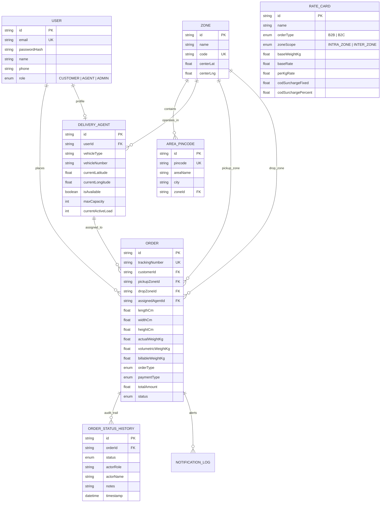

# Last-Mile Delivery Management & Dispatch Platform 🚚

> 🌐 **Live Hosted Platform**: [https://last-mile-delivery-tracker-iota.vercel.app](https://last-mile-delivery-tracker-iota.vercel.app)

A full-stack, enterprise-grade last-mile delivery and logistics management platform featuring dynamic volumetric rate calculation, automated geometric zone detection, intelligent nearest-agent auto-assignment, immutable event-sourced order tracking, customer-driven failure recovery, and real-time fleet telemetry.

---

## 🌟 Key System Capabilities

- 📐 **Dynamic Volumetric Rate Engine**: Automatically calculates package volume $(L \times B \times H) / 5000$, bills on the higher of physical vs volumetric weight, dynamically queries database rate cards (B2B vs B2C, Intra vs Inter-zone), and computes COD surcharges.
- 🗺️ **Automated Geometric Zone Resolution**: Resolves postal pincodes and GPS coordinates to operational delivery hubs using Haversine great-circle distance formulas and hierarchical area mappings.
- ⚡ **Intelligent Agent Auto-Assignment**: Multi-factor allocation heuristic matching nearest online drivers, prioritizing zone alignment, enforcing maximum load capacity thresholds, and balancing active delivery queues.
- 📜 **Immutable Order Lifecycle & Audit History**: Finite state machine transitions (`PLACED` $\to$ `ASSIGNED` $\to$ `PICKED_UP` $\to$ `IN_TRANSIT` $\to$ `OUT_FOR_DELIVERY` $\to$ `DELIVERED` / `FAILED`) logged with non-destructive actor details, timestamps, and geolocation coordinates.
- 🔄 **Failed Delivery Recovery & Rescheduling**: Mandatory reason code capturing on failed delivery attempts, automated customer alerts with secure rescheduling portal, and driver reassignment for the rescheduled slot.
- 📱 **Multi-Role Portals**: Dedicated workspaces for **Customers** (Order booking & Live tracking), **Delivery Agents** (Mobile task deck & GPS simulation), and **Admins** (Master dispatch deck, Rate Card builder, Zone manager, Fleet telemetry).
- 🌓 **Adaptive Light / Dark Mode**: Crisp UI with instant theme toggle and persistent user preferences.

---

## 🔑 Pre-Configured Demo Credentials

For quick evaluation, click the **1-Click Quick-Fill** buttons on the login page or use these pre-seeded accounts:

| Role | Email | Password | Console Capabilities |
| :--- | :--- | :--- | :--- |
| **Admin** | `admin@deliverytracker.com` | `admin123` | Master operations console, rate cards, zones, fleet telemetry, manual/auto assign |
| **Customer (B2C)** | `customer@gmail.com` | `customer123` | Retail customer portal, create shipments, live tracking, delivery rescheduling |
| **Customer (B2B)** | `b2b@acmecorp.com` | `customer123` | Enterprise logistics customer with heavy freight bulk shipments |
| **Delivery Agent 1** | `agent.rajesh@deliverytracker.com` | `agent123` | Motorcycle courier in North Zone with active delivery task deck |
| **Delivery Agent 2** | `agent.amit@deliverytracker.com` | `agent123` | Electric Van courier in South Zone |

---

## 🛠️ Architecture & Tech Stack

- **Framework**: Next.js 14 (App Router, TypeScript, React 18)
- **Styling**: Tailwind CSS, Lucide Icons
- **Backend & Database**: Dedicated cloud PostgreSQL database via Prisma ORM
- **Authentication**: JWT session tokens with role-based access control (`CUSTOMER`, `AGENT`, `ADMIN`) and `bcryptjs` password encryption
- **Mapping & Geo-Telemetry**: OpenStreetMap & Leaflet telemetry integration
- **Notifications**: Multi-channel email & SMS dispatcher with in-app simulation logs
- **Testing**: Vitest automated test suite for billing math, zone proximity, and state transitions

---

## 🗄️ Backend Infrastructure & Relational Persistence

The platform runs on a full-stack, distributed backend architecture engineered for reliable persistence, data consistency, and transactional integrity:

- **Cloud Relational Database**: Backed by a high-availability **PostgreSQL** instance with **Prisma ORM**, ensuring strict schema constraints, foreign key referential integrity, and ACID compliance.
- **Persistent User & Account Profiles**: All user accounts created through registration are permanently stored in the backend database. User profiles, authentication credentials, assigned roles, and driver telemetry persist seamlessly across all browser sessions, devices, and logins.
- **Cryptographic Security**: Passwords are automatically hashed and salted using industry-standard `bcryptjs` algorithms before storage. User authentication is managed via cryptographically signed JSON Web Tokens (JWT) with fine-grained Role-Based Access Control (RBAC).
- **Relational Data Mapping**: Directly maps relations across `Users`, `DeliveryAgents`, `Zones`, `AreaPincodes`, `RateCards`, `Orders`, and `OrderStatusHistory` for high-performance querying and zero data duplication.
- **Append-Only Immutable Event Logs**: State changes, delivery attempts, administrative status overrides, and customer reschedule events are permanently logged in relational history tables with timestamps, actor IDs, and geographic coordinates.

---

## 🧮 Rate Calculation Logic & Formulas

### 1. Volumetric Weight
Standard courier volume standardization:
$$\text{Volumetric Weight (kg)} = \frac{\text{Length (cm)} \times \text{Width (cm)} \times \text{Height (cm)}}{5000}$$

### 2. Billable Weight
$$\text{Billable Weight} = \max(\text{Actual Physical Weight}, \text{Volumetric Weight})$$

### 3. Dynamic Zone Rate Calculation
The system dynamically queries the active `RateCard` matching `(OrderType: B2B/B2C, ZoneScope: INTRA_ZONE/INTER_ZONE)`:
$$\text{Base Freight} = \text{BaseRate}$$
$$\text{Extra Weight} = \max(0, \text{Billable Weight} - \text{BaseWeightKg})$$
$$\text{Weight Surcharge} = \text{Extra Weight} \times \text{PerKgRate}$$

### 4. Cash-on-Delivery (COD) Surcharge
If `paymentType === "COD"`:
$$\text{COD Surcharge} = \max\left(\text{FixedSurcharge}, \text{MinSurcharge}, \text{DeclaredValue} \times \frac{\text{CODPercent}}{100}\right)$$

### 5. Final Order Total
$$\text{Total Amount} = \text{Base Freight} + \text{Weight Surcharge} + \text{COD Surcharge} + \text{Tax}$$

---

## 🤖 Intelligent Auto-Assignment Heuristic

When an order is created or auto-assigned by Admin:
1. **Candidate Pool Selection**: Query all delivery agents where `isAvailable === true` and `currentActiveLoad < maxCapacity`.
2. **Proximity Calculation**: Calculates great-circle Haversine distance from agent's current coordinates $(\text{lat}, \text{lng})$ to order pickup coordinates.
3. **Scoring Function**:
   $$\text{Score} = \text{Distance (km)} + (\text{ActiveLoad} \times 0.5) - (\text{OperatingZoneMatch} ? 2.0 : 0.0)$$
   *(Lower score is prioritized).*
4. **Atomic Assignment**: The optimal candidate is assigned, order transitions to `ASSIGNED`, agent's active load increments, and immutable history log is recorded.

---

## 🔄 Failed Delivery & Rescheduling Workflow

1. When a delivery agent encounters an issue, they mark the order as `FAILED` with a mandatory reason code (e.g. *Customer Unavailable*, *Incorrect Address*).
2. The order transitions to `FAILED`, the agent's active load is released, and a notification is dispatched to the customer.
3. The customer accesses `/track/[trackingNumber]` or their dashboard, clicks **Reschedule**, and selects a new delivery date and time slot.
4. The system updates the order to `RESCHEDULED` and triggers automatic re-assignment for the rescheduled attempt.

---

## 📊 Database Schema (Prisma Data Model)



---

## 🌐 Complete REST API Documentation

### Authentication (`/api/auth`)
- `POST /api/auth/register`: Register user with role (`CUSTOMER`, `AGENT`, `ADMIN`).
- `POST /api/auth/login`: User login, returns JWT token & sets session cookie.
- `GET /api/auth/me`: Fetch authenticated user profile & agent details.

### Dynamic Pricing & Rate Engine (`/api/rates`)
- `POST /api/rates/calculate`: Computes volumetric weight, zone matrix, rate card lookup, and full financial breakdown.

### Rate Cards & Zones Configuration (`/api/rate-cards`, `/api/zones`)
- `GET /api/rate-cards`: List configured B2B and B2C rate cards.
- `POST /api/rate-cards`: Admin create rate card (Intra/Inter-zone, base/increment rates, COD fees).
- `PUT /api/rate-cards`: Admin update rate card parameters.
- `GET /api/zones`: List operational delivery zones with pincode counts and active agents.
- `POST /api/zones`: Admin create delivery zone with centroid coordinates.
- `POST /api/zones/pincodes`: Admin map postal pincodes to zones.

### Orders & Dispatch Management (`/api/orders`)
- `GET /api/orders`: Query orders with RBAC and multi-filters (status, zone, agent, orderType).
- `POST /api/orders`: Create new delivery order with auto-calculated charges and immutable logging.
- `GET /api/orders/[id]`: Fetch single order details with full immutable audit trail.
- `POST /api/orders/[id]/assign`: Auto-assign nearest available agent or manual agent assignment.
- `POST /api/orders/[id]/status`: Transition order status (`PICKED_UP`, `IN_TRANSIT`, `OUT_FOR_DELIVERY`, `DELIVERED`, `FAILED`) or Admin override.
- `POST /api/orders/[id]/reschedule`: Customer reschedule failed delivery for a new date/slot.
- `GET /api/orders/track/[trackingNumber]`: Public tracking endpoint with live map telemetry.

### Delivery Fleet Telemetry (`/api/agents`)
- `GET /api/agents`: List all agents with live availability, active capacity loads, and GPS coordinates.
- `PUT /api/agents`: Toggle online/offline status or update live GPS coordinates.

---

## 🧪 Automated Testing

Automated test suite verifying volumetric math, rate calculation edge cases, Haversine distance formulas, and finite state machine transitions:

```bash
npm test
```

Test coverage includes:
- Volumetric weight vs actual weight calculation
- Intra-zone vs Inter-zone rate card application
- COD fixed vs percentage fee evaluation
- Haversine proximity calculations
- Order state transition graph enforcement & admin overrides

---

## 📄 Author & Copyright
Copyright © 2026 Atharv. All rights reserved.
